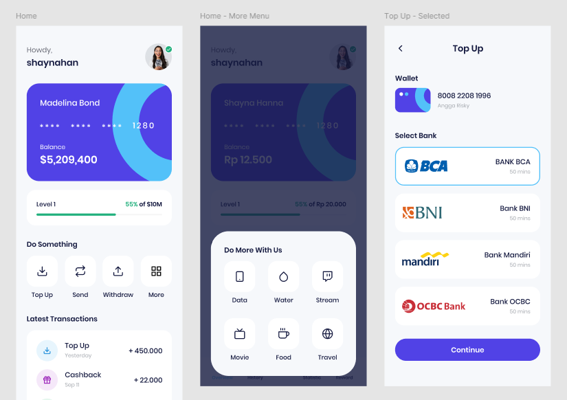

# Mobile E-Money App (Flutter)

A learning project to build a simple **mobile e-money application** using Flutter. This app demonstrates core digital wallet features including balance management, top-up, transfer, and payment gateway integration (Midtrans).

## ✨ Features

- User balance (saldo)
- Top-up balance
- Balance transfer
- Midtrans payment gateway integration
- Clean UI & simple flow
- Modular Flutter architecture

## 🛠 Tech Stack

- Flutter (Dart)
- REST API (mock / demo)
- Midtrans (sandbox)
- State management (basic)

## 📱 App Flow

1. User opens wallet
2. View current balance
3. Top-up via Midtrans
4. Transfer balance
5. Balance updated in real time

## 📸 Screenshots



## 🚀 Getting Started

```bash
git clone https://github.com/username/mobile-e-money.git
cd mobile-e-money
flutter pub get
flutter run
```
